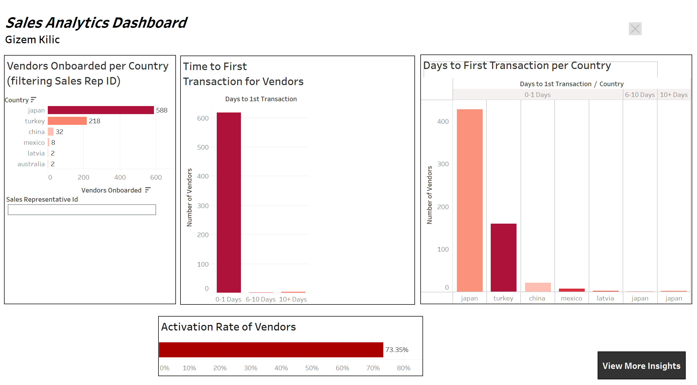
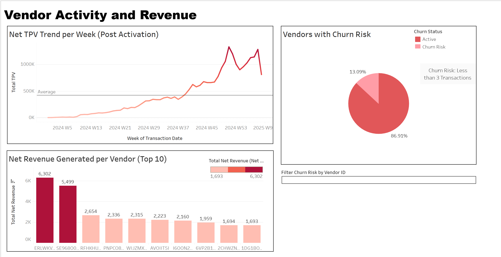

# Sales Analytics Dashboard

A Tableau dashboard exploring vendor activation, sales performance, and revenue trends using dummy field sales data. The data in .csv format was cleaned and queried on PostgreSQL.

[**View the Interactive Dashboard on Tableau Public**](https://public.tableau.com/views/SalesAnalytics_17442935115980/Dashboard1?:language=en-US&:sid=&:redirect=auth&:display_count=n&:origin=viz_share_link)

---

## Dashboard Overview

### 1. Vendor Acquisition & Activation
- Vendors onboarded per country and by sales representative
- Activation rate (% of vendors who start transacting)
- Time to first transaction (0–1 days, 6–10 days, 10+ days)

### 2. Sales Representative Efficiency
- Filterable view to compare onboarding success across different sales reps
- Identify high-performing countries and reps based on vendor onboarding

### 3. Vendor Activity & Revenue
- Weekly trend of Total Processed Volume (TPV) post-activation
- Top 10 vendors by net revenue generated

### 4. Churn Indicators
- Vendors flagged at churn risk (less than 3 transactions post-activation)
- Visual breakdown of active vs. at-risk vendors

---

## Data

The dashboard uses a dummy dataset simulating field sales and vendor transaction activity. All data is hashed and anonymized.

---

## Preview

*Vendor onboarding metrics and activation rates*

*TPV trends, top vendors by revenue, and churn risk overview*
